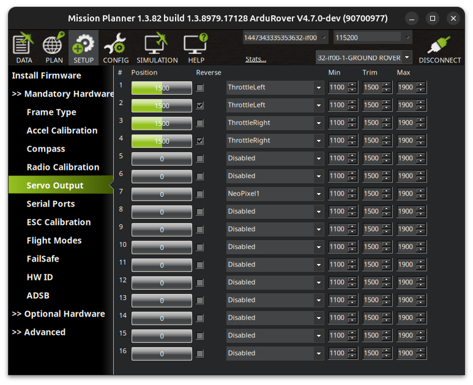
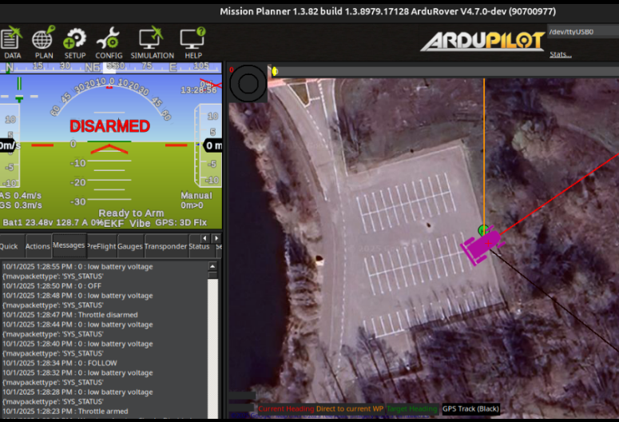
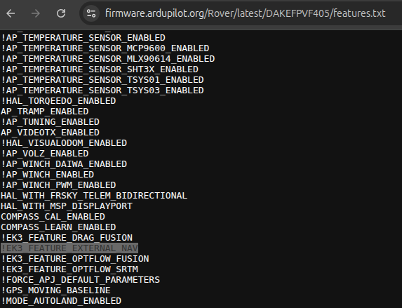
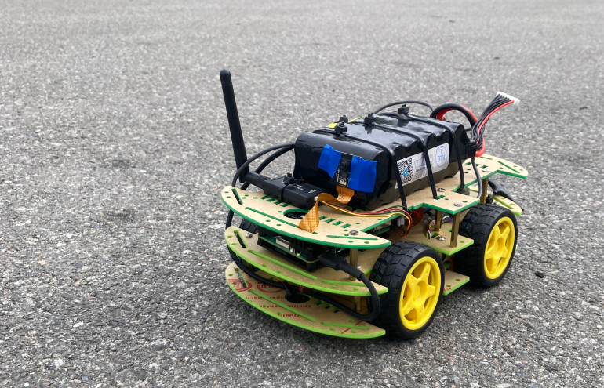

# Autopilot with target following for ArduRover (dev. version)

## Autopilot "LOONARR"
The "LOONARR" autopilot, designed for installation on a companion computer mounted on *Ground Robotic Platform* (powered with ArduRover), provides basic autonomous functionality. It `enables the Car to follow the target using Computer Vision capability on the ground`. This **`"system"`** serves as a development template and is ideal for autopilot developers looking to kickstart their own projects, particularly those aimed at implementing target-following capabilities based on computer vision in **`GNSS`** and **`non-GNSS environment`**. This is not a final solution but a good start for devs.

This code is largely adapted from another repository, [Autopilot with Target Following for FPV Combat Drone (Simulator version)](https://github.com/under0tech/autopilot_bee_sim), but is designed to work on real hardware, specifically a Raspberry Pi mounted on the **ArduRover** with [ArduPilot firmware](https://ardupilot.org) pre-installed. 

This **`dev. version`** has certain limitations, as features such as target selection, payload release, and anti-drone detection are not implemented. However, with the available configuration options, it can be adapted for use in both GNSS (Compass + GPS) and non-GNSS (LiDAR) environments.

## Environments
As mentioned above, this autonomous platform can be configured for use in both GNSS (outdoor) and non-GNSS (indoor) environments.

### GNSS environment
A `GNSS (Global Navigation Satellite System) environment` is the default configuration in which the ArduRover firmware operates. It requires `GPS and compass data` to function in `GUIDED` mode, which is necessary for the autopilot to follow the target. It will not likely operate if GPS is spoofed or unavailable.

### Non-GNSS environment
A `non-GNSS environment` is designed to work without a stable GPS signal — for example, indoors, in hangars, or even on the frontline where GPS is unavailable. It is preferable for developers to test and debug the autonomous platform in a non-GNSS environment due to the lower cost.

**Note:** Choosing either option requires the developer to configure both the autopilot and Rover settings as detailed in this document.

### MODES:
`OFF`  -  autopilot remains inactive, awaiting operator input to switch to another mode. In this state, only telemetry monitoring and logging are active.

`READY`  -  initializes the autopilot to its default state. If a target was previously followed and reached, this mode resets the state and prepares the system for the next mission.

`FOLLOW`  -  activates the basic functionality: the system attempts to detect the target (person), follow it, and disarm the vehicle once the target is reached and the mission is completed.

## Rover configuration
The *Ground Robotic Platform* used as a Car-model (Rover) in this primer is based on a `4WD chassis robot` layered on three levels:

`First or lower level` - 4 × TT yellow motors with a maximum consumption of 250 mA each. For 4 motors, the cumulative consumption is 1A. 2 × BTS7960 drivers are used for the left and right sides, respectively. An XL4015 DC-DC converter steps down 24V from the battery pack to 6–8V required by the TT motors, with a current limit of 5A. A Schottky diode SS54 is included, to prevent reverse current.


`Second or middle level` - Dake FPV F405 flight controller, QMC5883L compass, SpeedyBee ELRS Nano Receiver 2.4 GHz, BN-220 GPS module, 3DR 433 MHz telemetry module, 100 dB buzzer, and a Raspberry Pi 5 as the companion computer.


`Third or upper level` - 6S2P 24V battery pack and a 5V 5A DC-DC converter for the Raspberry Pi 5. Optionally, a LiDAR module.


### Rover components
Because of its complexity, I am not providing a full circuit schematic. Each experiment requires the builder to work through the design step-by-step to fully understand the wiring and the complete product. I give you the opportunity to create your own schematic based on your knowledge. However, I will still provide a high-level description so you understand my implementation.

`Battery pack 6S2P` connects to the FC using an 8-wire JST jack on front side: BAT to + and GND to -. Use a 1000 µF capacitor on its power input for power stabilization.

`XL4015 DC-DC converter` must be configured to output 6.5V / 3A to power the motor drivers with the current required by the TT yellow motors.  
B+ and B- on both drivers connect to the XL4015 converter VOUT and GND, respectively.

`TT motors on the left side` connect in parallel to the `BTS7960 (left side)` driver using the M+ and M- pads on the driver.

`TT motors on the right side` connect in parallel to the `BTS7960 (right side)` driver using the M+ and M- pads on the driver, respectively.

`BTS7960 (left side)` connects to the FC with an 8-wire JST jack on the front side of the FC as follows: S1 to RPWM, S2 to LPWM. Additional wiring: 5V to VCC, GND to GND. R_EN and L_EN must be tied to VCC on the driver to keep it always enabled.

`BTS7960 (right side)` connects to the FC with an 8-wire JST jack on the front side of the FC as follows: S3 to RPWM, S4 to LPWM. Additional wiring: 5V to VCC, GND to GND. R_EN and L_EN must also be tied to VCC on the driver to keep it always enabled.

`ELRS receiver` connects to the *Dake FPV F405 FC* using a 4-wire JST jack on the front side of the controller, or by wiring T2 to RX, R2 to TX, GD to GND, and 5V to the appropriate pad on the *SpeedyBee ELRS Nano Receiver 2.4 GHz*.

`GPS module BN-220` connects to the FC using 4 wires: 5V to VCC, GND to GND, T1 to RX, and R1 to TX on the GPS module.

`Compass QMC5883L` connects to the FC with 4 wires: SDA, SCL, 5V, and GND to the appropriate pads on the QMC5883L.

`Buzzer` connects to the FC as follows: BZ+ to VCC, BZ- to GND on the buzzer.

`3DR Telemetry module` connects to the FC with 4 wires: T4 to RX, R4 to TX, GND to GND, and 5V to VCC.

`Raspberry Pi 5` connects to the FC using a 6-wire JST jack on the bottom side of the FC: T5 to UART0_RXD, R5 to UART0_TXD, and GND to GND on the RPi accordingly.  
The RPi is powered by a 5V 5A DC-DC converter connected to the battery pack via an XT60 connector.

**Recommendations:**
- Assemble and test the system component-by-component. Do **not** try to build the entire device at once.  
- Connect and verify each module sequentially: power it up, confirm correct operation, then proceed to the next part.  
- Carefully check voltages and currents with a multimeter and compare them to each component’s specifications.  
- Double-check polarities and connections before the first power-up. Use a current-limited power supply, fuses, or other protection when possible.

## ArduPilot configuration
The flight controller **Dake FPV F405** must be flashed with the [ArduRover firmware](https://firmware.ardupilot.org/Rover/latest/DAKEFPVF405).  
Once done, configure the following parameters using the [Mission Planner software](https://ardupilot.org/planner/docs/mission-planner-installation.html) accordingly:

`FRAME_CLASS = 1` - Rover.  

`FRAME_TYPE = 0` - Undefined.  

`MOT_PWM_TYPE = 4` - BrushedBiPolar rover, allowing forward and reverse movement with 4WD motors.  



`SERVO1_FUNCTION = 73` - ThrottleLeft.  

`SERVO2_FUNCTION = 73 (with reverse checked)` - ThrottleLeft (reverse mode).  

`SERVO3_FUNCTION = 74` - ThrottleRight.  

`SERVO4_FUNCTION = 74 (with reverse checked)` - ThrottleRight (reverse mode).  

`RC5_OPTION = 153` - Control for ARM/DISARM.  

`ARMING_CHECK = 0` - Temporary (disables checks).  

`RC7_OPTION = 55` - Switch for GUIDED mode.  

`GPS1_TYPE = 2` - UBlox (if using BN-220).  

`SERIAL1_BAUD = 38` - 38400 baud rate for the GPS module.  

`EK3_GPS_CHECK = 0` - Temporary (disables GPS check).



`SERIAL4_BAUD = 57` - 57600 baud rate for the telemetry module.  

`SERIAL4_PROTOCOL = 42` - MAVLink2 (to control Rover via radio link from Mission Planner).  

`WP_SPEED = 0.5` - 0.5 m/s (50 cm/s) speed limit for Rover in GUIDED mode.

## Raspberry Pi configuration
The Raspberry Pi (RPi) acts as a companion computer in our setup, communicating with the ArduRover firmware on the flight controller (FC) via MavLink. 

Follow the instructions below to install the autopilot code on the RPi.

1. Download and extract this repository, including the `logs` folder, to the destination `/home/pi/Apps/loonarr` on your Raspberry Pi device.
2. Copy the files `config/run_autopilot.service` and `config/run_autopilot.sh` to their destination `/etc/systemd/system`, and give them the necessary permissions by running the `sudo chmod +x run_autopilot.sh` command in the bash console.
3. Enable the Autopilot service to run automatically on RPi startup
   
   ```bash
   sudo systemctl enable run_autopilot.service
   reboot
   ```
4. Go to the `logs` folder, after its restart, and ensure that new files are being generated, indicating everything is working correctly. If not, check the `definitions.py` and adjust the settings as needed.

## Non-GNSS environment
All settings described above are designed for a `GNSS environment` and will only work when your Rover has a **stable GPS signal and a healthy compass**.  
In a `non-GNSS environment` (inside the room), you will need to make a few modifications as described in this section.

### ArduPilot changes
When operating without GNSS, you’ll need to adjust the EKF configuration to rely on *External Navigation (ExternalNAV)* instead of GPS.

Required parameter changes:

- `EK3_SRC1_POSXY = 6` → use *ExternalNAV* for horizontal position  
- `EK3_SRC1_VELXY = 6` → use *ExternalNAV* for horizontal velocity  
- `EK3_SRC1_VELZ = 6` → use *ExternalNAV* for vertical velocity  
- `GPS1_TYPE = 0` → disable GPS  

This setup is based on the official [ArduPilot Cartographer SLAM guide](https://ardupilot.org/dev/docs/ros-cartographer-slam.html) documentation.

Important notes:
- Your flight controller (FC) **must support** the `VISION_POSITION_ESTIMATE` MAVLink message in its firmware.  
- The *Dake FPV* controller does **not** support it. In this case, use a board such as *Pixhawk*.  
- Always verify that `EK3_FEATURE_EXTERNAL_NAV` is enabled in your firmware’s `features.txt` file.  
- If it’s marked with `!`, it means the feature is **disabled**.



As shown in the image above, you may need to make *additional efforts* to complete experiment in a non-GNSS environment.

### Autopilot settings
When operating **without GPS**, you need to switch the Autopilot into `non-GNSS mode` by enabling the parameter:
```python
odometry_enabled = True
```
Then set the parameter `odometry_url` to the port used by the **Odometry provider**. This must be different from the standard `mavlink_url` defined in *definitions.py*, because **RPLidar sensor data** and **MAVLink control commands** need to run in parallel threads. For this reason, two separate connections to the flight controller are required.

For more details, see the corresponding section in [README_DEV.md](README_DEV.md).

## How to use
Whether you just want to install the autopilot to observe its functionality, or run it on a real RPi, you will need to install the requirements using `requirements.txt` as shown bellow.

```bash
pip install -r requirements.txt
```
If you encounter issues during installation, try the following command:
```bash
pip install ultralytics --timeout 300 --break-system-packages
```
To run the autopilot on the *developer's computer* to observe its functionality and for debugging, use the following command:
```bash
python3 main.py
```
If you run it on a real RPi, follow these steps to check functionality:

1. Power on the *RadioMaster TX* (or another ELRS transmitter).
2. Connect the battery pack to the Rover’s XT60 input.
3. Verify Rover responds to TX: switch modes, ARM/DISARM, drive in `MANUAL` mode.
4. Switch RC7 (`chan7_raw`) to `GUIDED` mode. ARM the Rover. Stand in front of the camera.
5. Wait ~2 seconds. Rover should drive toward you.
6. When Rover reaches you, it will auto-DISARM and the buzzer will sound.



In a `non-GNSS environment`, the Rover will work as described.  

In a `GNSS environment`, ensure that the Rover has a *stable GPS signal and a healthy compass signal* before switching to `GUIDED` mode using *Telemetry module* and *Mission Planner* software.  

Experiment with the Rover and your *CV-based autopilot* as much as you like. 

## Customize this Autopilot
This source code and configuration is shared to help the developer community in Ukraine get an easy start when developing autonomous systems and computer-vision-based autopilots, especially for building autonomous *Ground Robotic Platforms* with AI on board. It may be useful *as a template* for applications such as **evacuation rovers**, **delivery rovers**, **frontline bombers**, etc.

If you are a developer (or have dev. skills), you are welcome to use this code as a starting point for your own autopilot and computer-vision experiments. For detailed instructions and configuration notes, see [README_DEV.md](README_DEV.md). Share improvements and *tested builds* with others. The community will appreciate your contributions.

## Troubleshooting
Take your time during the initial setup — installing dependencies, integrating hardware components, and configuring settings can reveal many small issues because a lot of nodes are involved. Be patient, and good luck.

## Get in touch
If you have any questions, feel free to contact me on Twitter: 
https://twitter.com/dmytro_sazonov
