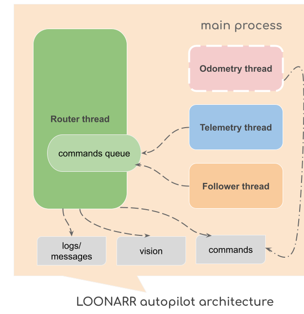

# Autopilot with target following for ArduRover (guide for developers)

## Architecture
The Autopilot "LOONARR" uses a multi-threaded design built around a central command queue and a command router. The `Router thread` processes queued commands, while the `Telemetry thread` and `Follower thread` simply append commands to the queue. An optional `Odometry thread` is enabled in `non-GNSS environment` to support indoor navigation or operation under Electronic Warfare (EW) conditions.



The `Telemetry thread` appends commands to the queue for system monitoring and telemetry requests. It provides the Autopilot with vital information such as current vehicle speed, RC channel values, remaining battery, etc.

The `Follower thread` is responsible for detecting and tracking the target when it is within the camera’s field of view. It issues movement commands to maintain pursuit.

The `Odometry thread` supplies the system with positional data in `non-GNSS environment`. It emulates sensor inputs (e.g., LiDAR) to estimate the Rover’s position and heading, enabling indoor navigation or operation under Electronic Warfare (EW) conditions.

While in operation, the Autopilot relies on several sub-modules, including computer vision with [YOLOv8 from Ultralytics](https://www.ultralytics.com) for target detection and following, [MAVLink commands](https://ardupilot.org/dev/docs/mavlink-rover-commands.html) for controlling Rover movement from RPi, and telemetry streaming to the Ground Control Station ([ArduPilot GCS](https://ardupilot.org)) for monitoring and operator feedback.

## main.py and threads
`main.py` is the entry point for launching the Autopilot. To execute it, follow the instructions in [README.md](README.md).  
When started, it initializes the command queue, spawns the sub-processes (threads) described above, and issues the `INIT` command. This triggers the Autopilot initialization process, including requests for all telemetry streams from the Rover.

## Autopilot state and settings
The Autopilot uses two files that define its initial state and configuration:  
- [autopilot.py](autopilot.py) — defines the `Autopilot state`, which is updated during execution.  
- [definitions.py](definitions.py) — defines the `Autopilot settings`, which configure system behavior.  
```python
state = {
    'connection' : False,
    'odometry_connection' : False,
    'bee_state' : 'OFF', # OFF, READY, FOLLOW
    'battery': 0,
    'speed': 0,
    'completed': False,
    'frame': {},
    'target_lost': 0,
}
```
The `Autopilot state`, as defined above, represents the key parameters used during Autopilot operations. These values may change dynamically during program execution:  

- **`connection`**: Initially `False`. Set to `True` once a connection with the Rover is established.  
- **`odometry_connection`**: Initially `False`. Set to `True` once a connection is established with the Rover on a separate port for the odometry provider (non-GNSS mode).  
- **`bee_state`**: Operating mode of the Autopilot. Can be one of the following: `OFF`, `READY`, or `FOLLOW` (see introduction in [README.md](README.md)).  
- **`battery`**: Current battery capacity as a percentage. If the value drops below 20%, the Autopilot issues a `low battery voltage` warning to the pilot.  
- **`speed`**: Current speed of the Rover.  
- **`completed`**: Initially `False`. Set to `True` when the payload has been delivered.  
- **`frame`**: Initially `{}`. Updated when the first target is recognized for tracking.  
- **`target_lost`**: Counts how many times the target has been lost during tracking.

```python
mavlink_url = '/dev/ttyACM0' # if UART use /dev/ttyAMA0
logger_name = 'LOONARR-1'
logger_directory = '/home/pi/Apps/loonarr/logs' # for DEV 'logs'
vision_model = '/home/pi/Apps/loonarr/pt/yolov8n.pt' # for DEV 'pt/yolov8n.pt'
vision_classes = [0]  # 42 - for tennis ball, 0 - person
video_source = 255 # 0 - defult video camera, 255 - PI video camera
camera_width = 160
camera_height = 120
target_lost_limit = 3
odometry_url = '/dev/ttyUSB0'
odometry_enabled = False
```

The `Autopilot settings`, as defined above, configure the resources and connections used during Autopilot operations, including the video camera, MAVLink communication, and more.  

- **`mavlink_url`**: Path for connecting to the MAVLink port, where the companion computer communicates with the Rover’s flight controller (FC).  
- **`logger_name`**: Name of the logger associated with the Autopilot, e.g., `'LOONARR-1'`.  
- **`logger_directory`**: Directory where log files are stored.  
- **`vision_model`**: Path to the vision model file used for object detection, e.g., `'pt/yolov8n.pt'`.  
- **`vision_classes`**: List of classes to be detected by the vision model, represented as integers. Example: `[0]` for person, `[42]` for tennis ball.  
- **`video_source`**: Video input source, represented as an integer:  
  - `0` — default USB camera.  
  - `255` — Raspberry Pi camera.  
- **`camera_width`** and **`camera_height`**: Dimensions of the camera feed. Values depend on the video source:  
  - USB camera: `640x480`  
  - Raspberry Pi camera: `160x120`  
- **`target_lost_limit`**: Maximum number of times the target can be lost during tracking before corrective actions (such as yaw adjustment) are triggered.  
- **`odometry_url`**: Path for connecting to the MAVLink port used to transmit LiDAR (RPLidar) data in non-GNSS mode.  
- **`odometry_enabled`**: Enables non-GNSS navigation mode. Default is `False`. When set to `True`, the Autopilot transmits `VISION_POSITION_ESTIMATE` messages at 20Hz for indoor navigation.

## MAVLink commands
Communication between the companion computer (Autopilot) and the Rover is handled through **MAVLink commands**, defined in [commands.py](commands.py). These commands cover a wide range of functionality, including:

- Notifications to Ground Control  
- Telemetry requests  
- System monitoring  
- Odometry transmission  
- Control of the Rover’s speed, direction, and movement  

The file also includes predefined scenarios for target following, target search, and Rover initialization, providing a complete list of MAVLink commands for communication between the Autopilot and the Rover.

Most commands have an associated delay period, defined in the `command_delays` object. These delays ensure that the system router waits for a command to finish execution before moving on to the next one.

## Router
As described in the **Architecture** section, the [router](router.py) (also referred to as the *Command Executor*) is the central component of the application. It manages all commands that are added to the command queue.  

Currently, the router supports the following commands:
```python
commands = {
    'INIT': command_init,
    'MONITOR': command_monitor,
    'TELEMETRY': command_telemetry,
    'FOLLOW':command_follow,
    'DISARM': command_disarm,
}
```

- **INIT**: Initializes the Rover by requesting all data streams.  
- **MONITOR**: Retrieves the Rover’s system status, including battery voltage.  
- **TELEMETRY**: Obtains the current speed and `RC_CHANNELS` values from the FC.  
- **FOLLOW**: Starts the target-following scenario.  
- **DISARM**: Disarms the Rover’s motors in case of low battery voltage.  

Each command method contains its own logic, sends messages to the appropriate targets, and executes the corresponding MAVLink commands.

## Telemetry and Odometry
Sensor data flows between the Flight Controller (FC) and the Autopilot in both directions:  

- **Telemetry data** (e.g., battery level, speed) is sent from the FC to the Autopilot.  
- **Odometry data** (from the LiDAR sensor) is sent from the Autopilot to the FC for non-GNSS navigation.  

These data streams allow both the Autopilot and the FC to monitor the current state and respond appropriately during operation.  

Both processes run in parallel threads:  
- [telemetry.py](telemetry.py) regularly requests data for monitoring (`SYS_STATUS`) and retrieves `RC_CHANNELS` values from the radio controller.  
- [odometry.py](odometry.py) transmits `VISION_POSITION_ESTIMATE` messages from the LiDAR sensor to the FC at 20Hz freq., enabling non-GNSS navigation if configured.

## Follower
The [follower.py](follower.py) process manages the addition of commands to the queue for target following under specific conditions.

If the target has not yet been found and the Autopilot is in `FOLLOW` mode, it generates a `FOLLOW` command every 2 seconds to allow the Rover to locate and track the target (e.g., a person).

It also resets the Autopilot state when the mode is changed to `READY`. For example, if a target was found during a previous mission, this prepares the system for the next mission by clearing the completion state back to its default. From this point, when the Rover is switched to `FOLLOW` mode again, it is ready to execute the next mission.

## Computer vision
Computer vision is the corner stone of the target tracking process and a critical part of Autopilot functionality. It effectively acts as the "eyes" of the Autopilot, enabling the system to detect and track objects.

This Autopilot uses the [YOLOv8 model](https://www.ultralytics.com) for object detection. Specifically, it employs the [yolov8n.pt](pt/yolov8n.pt) model and uses the `0 - Person` detection class.

For working with video frames, the Raspberry Pi camera, and handling different resolutions, the Autopilot also uses [OpenCV](https://opencv.org) and [Picamera2](https://www.raspberrypi.com/documentation/computers/camera_software.html#picamera2).

Object detection and target following involve several complex tasks, including:
- converting the target's position from the image frame to Cartesian coordinates (NED - North, East, Down)
- adjusting the Rover’s position and speed as needed
- taking into account the scale and conversion factors.

All of this functionality is implemented within the **Computer Vision** module, located in [vision.py](vision.py) file.

## Messages and logger
The application includes a set of predefined messages for various events and maintains a list of targets to notify as needed. Messages can be sent to:  

- Ground Control (or FPV goggles)
- The application console
- Log files
- Or any combination of the above

This functionality is managed by [messages.py](messages.py).

In addition, [logger.py](logger.py) handles writing messages to log files, which are essential for reviewing the Rover's behavior, tracking target paths, and analyzing Autopilot performance.

All logs (**.log files**) and captured images (**.png files**) used for object detection and target tracking are stored in the `Logs` folder. This folder provides a complete record of the Autopilot’s operations during each mission.

## What’s next
As mentioned earlier in the [README.md](README.md), this primer is intended to help the developer community in Ukraine get started with autonomous systems and computer-vision-based autopilots with AI onboard. It can serve as a **template** for applications such as:

- **evacuation rovers** – autonomous vehicles designed to transport people or supplies safely from hazardous areas.
- **delivery rovers** – rovers used for delivering goods, medical supplies, or equipment to designated locations.
- **reconnaissance rovers** – vehicles equipped with sensors and cameras for gathering intelligence and surveying terrain.
- **demining rovers** – robots designed to detect and safely neutralize landmines and explosive devices.
- **frontline bombers** – autonomous systems capable of delivering payloads in combat scenarios.
- and other autonomous variants – any other specialized autonomous vehicles for specific tasks or missions.

If you have development skills, you are welcome to use this code as a starting point for your own computer vision experiments. Once you have results, share them with the community in Ukraine.

## Get in touch
For any questions, feel free to message me on Twitter:
https://twitter.com/dmytro_sazonov


